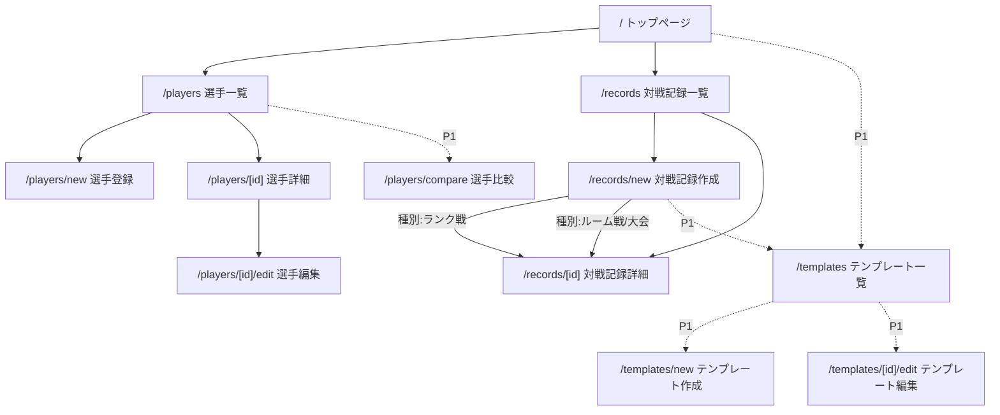

# 04. 画面設計

- 作成日: 2026-08-05
- 位置づけ: [02_requirements.md](./02_requirements.md)(要件定義)・[03_replace_plan.md](./03_replace_plan.md)(リプレイス方針・優先順位)を踏まえた画面一覧・画面遷移の設計。
- 用語: ランク戦・ルーム戦・大会をまとめた上位概念を **「対戦記録」** と呼ぶ(ヒアリングで確定)。「大会」は対戦記録の1種別(rank_battle / room_battle / tournament のうちの tournament)を指す。

---

## 1. ナビゲーション構成

現行の4タブ構成を踏襲しつつ、対戦記録を統合したタブ構成に変更する。

```
[トップ]  [選手]  [対戦記録]  [テンプレート]*
```
\* テンプレートタブはP1で追加。MVPでは3タブ構成。

## 2. 画面一覧

| # | 画面名 | パス | フェーズ | 概要 |
|---|--------|------|---------|------|
| 1 | トップページ | `/` | MVP(簡易) → P1(刷新) | MVPでは簡易な案内のみ。P1でダッシュボード化(直近成績サマリー等) |
| 2 | 選手一覧 | `/players` | MVP → P1(ランキング/フィルタ追加) | 打者/投手タブで一覧表示。P1でソート・フィルタ機能を追加 |
| 3 | 選手登録 | `/players/new` | MVP | 選手の新規登録フォーム |
| 4 | 選手詳細 | `/players/[id]` | MVP → P1(成績推移グラフ追加) | 選手の基本情報を表示。P1で成績推移グラフを追加表示 |
| 5 | 選手編集 | `/players/[id]/edit` | MVP | 選手情報の編集フォーム(登録画面と共通コンポーネントを想定) |
| 6 | 選手比較 | `/players/compare` | P1 | 2人以上の選手を選択し、成績を並べて比較表示 |
| 7 | 対戦記録一覧 | `/records` | MVP | ランク戦/ルーム戦/大会をまとめて一覧。種別タブ or フィルタで絞り込み |
| 8 | 対戦記録作成 | `/records/new` | MVP | 種別(ランク戦/ルーム戦/大会)を選択して作成。ランク戦は1試合分のオーダー+成績を直接入力、ルーム戦/大会はコンテナ(名前等)のみ作成 |
| 9 | 対戦記録詳細 | `/records/[id]` | MVP → P1(スクリーンショット添付) | ランク戦: 1試合の結果を表示(修正・削除のみ、履歴管理なし)。ルーム戦/大会: 現在のオーダー・成績を表示・上書き編集。P1でスクリーンショット添付欄を追加 |
| 10 | オーダーテンプレート一覧 | `/templates` | P1 | 保存済みのオーダーテンプレート一覧 |
| 11 | オーダーテンプレート作成/編集 | `/templates/new`, `/templates/[id]/edit` | P1 | よく使う打順・投手起用パターンの保存・編集 |

補足:
- 「成績推移グラフ」「ランキング/フィルタ」「スクリーンショット添付」は独立画面ではなく、既存画面(選手詳細・選手一覧・対戦記録詳細)への機能追加として実装する。
- 「選手検索・オートコンプリート」は対戦記録作成/編集画面内のオーダー入力UIの一部として実装する(独立画面ではない)。

## 3. 画面遷移図



## 4. 画面ごとの詳細

### 4.1 トップページ(`/`)
- **MVP**: アプリ名の表示のみ、または対戦記録一覧・選手一覧への導線程度の簡易ページ
- **P1**: 直近の対戦記録サマリー、好調選手のハイライト等を表示するダッシュボードへ刷新

### 4.2 選手一覧(`/players`)
- 打者/投手をタブで切り替えて一覧表示
- 各行から選手詳細へ遷移
- 新規登録ボタンから `/players/new` へ
- **P1**: 本塁打数・防御率等でのソート、絞り込みフィルタを追加

### 4.3 選手登録・編集(`/players/new`, `/players/[id]/edit`)
- 打者/投手の種別に応じて入力項目を出し分け(現行の`PlayerForm.tsx`の構成を踏襲)
- 登録・編集フォームは共通コンポーネントとして実装(責務分離の改善点に対応)

### 4.4 選手詳細(`/players/[id]`)
- 基本ステータス(スピリッツ・限界突破・特能等)を表示
- **P1**: 過去の対戦記録から算出した成績推移グラフを表示

### 4.5 選手比較(`/players/compare`)【P1】
- 2人以上の選手を選択し、主要成績を並べて表示
- 比較対象の選手選択には4.2と同様の検索・絞り込みを利用

### 4.6 対戦記録一覧(`/records`)
- ランク戦/ルーム戦/大会を種別タブまたはフィルタで切り替えて一覧表示
- 各行から対戦記録詳細へ遷移
- 新規作成ボタンから `/records/new` へ

### 4.7 対戦記録作成(`/records/new`)
- まず種別(ランク戦/ルーム戦/大会)を選択
- **ランク戦を選択した場合**: その場でオーダー(出場選手)と各選手の成績を入力し、保存すると1試合分の記録が確定する(都度新規作成)
- **ルーム戦/大会を選択した場合**: 名前など最小限の情報でコンテナを作成し、詳細画面(4.8)でオーダー・成績を編集していく
- **P1**: オーダーテンプレートから選手構成を呼び出す導線を追加

### 4.8 対戦記録詳細(`/records/[id]`)
- **ランク戦**: その試合のオーダー・成績を表示。修正・削除は可能だが、変更履歴は保持しない(要件定義で確定済み)
- **ルーム戦/大会**: 現在のオーダー・成績を表示し、そのまま上書き編集できる(履歴は残さない)
- **P1**: 成績画面のスクリーンショットを添付できる欄を追加

### 4.9 オーダーテンプレート一覧・作成・編集(`/templates`, ...)【P1】
- よく使う打順・投手起用パターンを名前を付けて保存
- 対戦記録作成時に呼び出して初期値として利用

## 5. 未決定事項

- ダッシュボード(4.1のP1版)に具体的にどの指標を表示するか(直近◯件、勝率、ホームラン数など)
- 選手比較(4.5)で比較できる人数の上限、比較する項目の範囲(打者/投手混在は不可、等の制約有無)
- 対戦記録一覧(4.6)のデフォルトの並び順・絞り込み条件
- オーダーテンプレート(4.9)を打者用/投手用で分けて保存するか、一体で保存するか
