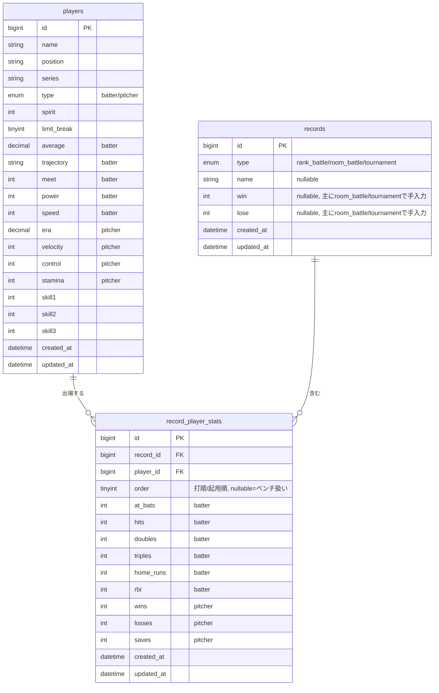

# 05. DB設計

- 作成日: 2026-08-06
- 位置づけ: [02_requirements.md](./02_requirements.md)・[03_replace_plan.md](./03_replace_plan.md)・[04_screen_design.md](./04_screen_design.md)を踏まえたMySQLのテーブル設計。
- 対象: MVP(P0)のテーブルを中心に、P1で追加するテーブルも設計する。P2以降(LINE連携・認証)のテーブルは別途検討する。
- 用語: 「対戦記録」= ランク戦/ルーム戦/大会をまとめた上位概念([04_screen_design.md](./04_screen_design.md)で確定)。

---

## 1. 設計方針

- テーブル名・カラム名は snake_case、複数形テーブル名で統一する。
- 現行スキーマで発生していた「モデル/バリデーションとDBカラムの不整合」([01_current_analysis.md](./01_current_analysis.md) 9章)を防ぐため、実際に使う値のみをカラムとして持つ(将来使うかもしれない項目を先回りして追加しない)。
- ロースター制限を設けない([02_requirements.md](./02_requirements.md) 4.1)ため、対戦記録作成時に全選手ぶんの初期成績行を自動生成する現行方式(`PlayerController@create`)は廃止し、**その対戦記録で実際にオーダーに入れた選手の行のみ**を作成する。

## 2. ER図(MVP)

## 3. テーブル定義(MVP)

### 3.1 players(選手)

| カラム | 型 | 制約 | 備考 |
|--------|----|----|----|
| id | bigint | PK, auto increment | |
| name | varchar(255) | NOT NULL | |
| position | varchar(10) | NOT NULL | ポジション/ロールのコード値(例: `C`, `1B`, `SP`, `CL`)。値の一覧は [04_screen_design.md](./04_screen_design.md) の元になった `constants/common.ts` のマスタに準拠し、アプリ側で検証する |
| series | varchar(255) | NULL可 | シリーズ(カード種別) |
| type | enum('batter','pitcher') | NOT NULL | |
| spirit | int | NOT NULL | スピリッツ |
| limit_break | tinyint | NOT NULL | 限界突破段階 |
| average | decimal(5,3) | NULL可 | 打者専用 |
| trajectory | varchar(10) | NULL可 | 打者専用(弾道コード) |
| meet | int | NULL可 | 打者専用 |
| power | int | NULL可 | 打者専用 |
| speed | int | NULL可 | 打者専用 |
| era | decimal(4,2) | NULL可 | 投手専用 |
| velocity | int | NULL可 | 投手専用 |
| control | int | NULL可 | 投手専用 |
| stamina | int | NULL可 | 投手専用 |
| skill1 | int | NULL可 | 特能ID(超特能想定) |
| skill2 | int | NULL可 | 特能ID |
| skill3 | int | NULL可 | 特能ID |
| created_at / updated_at | datetime | NOT NULL | |

**現行からの変更点**: `skill1`〜`skill3` は現行DBでは`string`だったが、フロントの型定義(`number`)・マスタ定義(`constants/common.ts`の`value`は数値)に合わせて `int` に変更する(01章で指摘した型の不整合を解消)。

### 3.2 records(対戦記録)

| カラム | 型 | 制約 | 備考 |
|--------|----|----|----|
| id | bigint | PK, auto increment | |
| type | enum('rank_battle','room_battle','tournament') | NOT NULL | 対戦記録の種別 |
| name | varchar(255) | NULL可 | ルーム戦/大会での名称。ランク戦は未入力想定(画面側で「ランク戦 #ID」等の表示に留める) |
| win | int unsigned | NULL可 | 主にルーム戦/大会で手入力する通算勝利数。ランク戦では未使用(その試合の勝敗はpitcherの`wins`/`losses`から判別) |
| lose | int unsigned | NULL可 | 同上(敗北数) |
| created_at / updated_at | datetime | NOT NULL | 記録日時。対戦記録共通の「日付」項目は持たず、`created_at`を記録日として扱う(要件ヒアリングで確定) |

**現行からの変更点**:
- `slug`、`start_date`/`end_date`、`description`は廃止(要件に無い、またはスキーマと不整合だったため)。
- タイプの値を `rank_battle` / `room_battle` / `tournament` に統一し、二重定義([01_current_analysis.md](./01_current_analysis.md) 9章5)を解消。
- 対戦相手情報は持たない(要件ヒアリングで「含めない」と確定)。

### 3.3 record_player_stats(対戦記録ごとの選手成績)

| カラム | 型 | 制約 | 備考 |
|--------|----|----|----|
| id | bigint | PK, auto increment | |
| record_id | bigint | FK → records.id, NOT NULL, ON DELETE CASCADE | |
| player_id | bigint | FK → players.id, NOT NULL, ON DELETE CASCADE | |
| order | tinyint unsigned | NULL可 | 打順/起用順。`NULL`はベンチ(起用なし)を表す |
| at_bats | int unsigned | NULL可 | 打者: 打数 |
| hits | int unsigned | NULL可 | 打者: 安打 |
| doubles | int unsigned | NULL可 | 打者: 二塁打 |
| triples | int unsigned | NULL可 | 打者: 三塁打 |
| home_runs | int unsigned | NULL可 | 打者: 本塁打 |
| rbi | int unsigned | NULL可 | 打者: 打点 |
| wins | int unsigned | NULL可 | 投手: 勝利数 |
| losses | int unsigned | NULL可 | 投手: 敗北数 |
| saves | int unsigned | NULL可 | 投手: セーブ数 |
| created_at / updated_at | datetime | NOT NULL | |

制約: `UNIQUE (record_id, player_id)` — 1つの対戦記録内で同じ選手の行が重複しないようにする(ルーム戦/大会での上書き編集は `UPDATE`、新規出場は `INSERT` で表現)。

**現行からの変更点**:
- `is_bench` カラムを廃止し、`order IS NULL` をベンチ扱いとして扱う(冗長な状態表現を削除)。
- `position_type`(batter/pitcher)カラムを廃止し、`players.type` を参照する(同じ情報を2箇所で持たない)。
- 対戦記録作成時に全選手ぶんの初期行を自動生成する処理は行わず、**実際にオーダーに入れた選手の行のみ**を作成する(ロースター制限なし・不要なダミー行を作らない設計)。
- 現行の`bulkUpdatePlayerStats`が書き込もうとしていた存在しないカラム(`games`, `draws`, `win_rate`, `innings`, `strikeouts`, `whip`, `average`)は持たない。

## 4. テーブル定義(P1)

P1(効率化・分析機能)で追加するテーブル。詳細は実装フェーズに入る際に改めて設計を詰める。

### 4.1 order_templates(オーダーテンプレート)

| カラム | 型 | 制約 | 備考 |
|--------|----|----|----|
| id | bigint | PK | |
| name | varchar(255) | NOT NULL | テンプレート名 |
| created_at / updated_at | datetime | NOT NULL | |

### 4.2 order_template_entries(テンプレート内の選手構成)

| カラム | 型 | 制約 | 備考 |
|--------|----|----|----|
| id | bigint | PK | |
| order_template_id | bigint | FK → order_templates.id, ON DELETE CASCADE | |
| player_id | bigint | FK → players.id, ON DELETE CASCADE | |
| order | tinyint unsigned | NULL可 | 打順/起用順 |

### 4.3 record_attachments(対戦記録へのスクリーンショット添付)

| カラム | 型 | 制約 | 備考 |
|--------|----|----|----|
| id | bigint | PK | |
| record_id | bigint | FK → records.id, ON DELETE CASCADE | |
| file_path | varchar(255) | NOT NULL | 保存先パス/URL |
| created_at | datetime | NOT NULL | |

ファイルの実体保存先(ローカルストレージ/S3等)は [07_architecture.md](./07_architecture.md)(作成予定)で検討する。

## 5. 未決定事項

- `records.win` / `records.lose` を持たない対戦記録種別(ランク戦)について、画面上どう表示・非表示を制御するか(DBはNULL許容で対応済みだが、UI側の扱いは04で詳細化が必要)
- P1テーブル(4章)の詳細な制約・インデックス設計は、該当フェーズの実装時に改めて設計する
- 選手の`position`・`trajectory`・`skill1〜3`などコード値の妥当性をDB制約(CHECK/ENUM)で担保するか、アプリ層のバリデーションのみに委ねるかは未決定(MySQLのバージョンによる`CHECK`制約対応状況にも依存するため、[07_architecture.md](./07_architecture.md)で使用するMySQLバージョンを決めた後に判断する)
