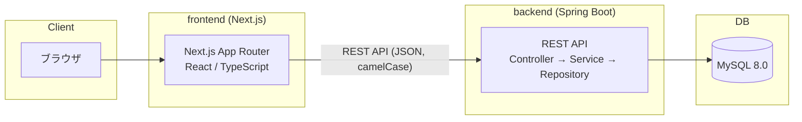

# 07. アーキテクチャ

- 作成日: 2026-08-08
- 位置づけ: [02_requirements.md](./02_requirements.md)〜[06_api_design.md](./06_api_design.md)を踏まえた、システム全体の技術構成の設計。
- 前提: 現時点ではローカル開発を最優先しつつ、**将来的なクラウドデプロイ(学習目的も兼ねる)を見据えた構成**にする。デプロイ先の具体的な選定は未定([6. 未決定事項](#6-未決定事項)参照)。

---

## 1. 全体構成図



MVPでは認証を挟まない([02_requirements.md](./02_requirements.md) 6章の通り、P3で別途追加)。

## 2. 技術スタック

| 領域 | 技術 | 備考 |
|------|------|------|
| フロントエンド | Next.js 14(App Router)/ React 18 / TypeScript 5 | 現行フロントの構成を踏襲 |
| UIライブラリ | MUI(Material UI) | 現行踏襲。3.のコンポーネント分割方針に沿って再構成する |
| データ取得 | TanStack Query | 現行踏襲。`axios-case-converter`は[06_api_design.md](./06_api_design.md)の方針により廃止 |
| バックエンド | Spring Boot 3系(最新安定版) | 実装着手時にその時点の最新安定版を確認して固定する |
| 言語(バックエンド) | Java 21(LTS) | Spring Boot 3系の要件を満たすLTS版を採用。選定理由は[ADR-0001](./decisions/0001-backend-tooling.md) |
| ビルドツール(バックエンド) | Maven | 設定が明示的で学習しやすいことを重視。選定理由は[ADR-0001](./decisions/0001-backend-tooling.md) |
| Lombok | 不使用 | 学習段階のため、getter/setter等を自動生成せず明示的に書く。理由は[ADR-0001](./decisions/0001-backend-tooling.md) |
| ORM | Spring Data JPA | エンティティとDBのマッピングに使用 |
| スキーマ管理 | Flyway | Hibernateの自動DDL生成(`ddl-auto`)は使わず、バージョン管理されたSQLでスキーマを厳密に管理する。選定理由は[ADR-0002](./decisions/0002-schema-migration-tool.md) |
| DB | MySQL 8.0系 | ヒアリングで確定 |
| コンテナ | Docker / Docker Compose | ローカル開発環境の統一に使用。`docker/`配下に構成を置く(既定のディレクトリ構成通り) |

## 3. バックエンドのレイヤードアーキテクチャ

CLAUDE.mdの「コンポーネントは責務を分離」という方針をバックエンドにも適用し、以下の層に分ける。

```
Controller層 … HTTPリクエスト/レスポンスの受け口。バリデーション・DTO変換のみを担当
Service層    … ビジネスロジック(例: 対戦記録作成時の初期化処理、成績upsertのロジック)
Repository層 … DBアクセス(Spring Data JPA)
Entity層     … DBテーブルに対応するデータクラス
```

各層の責務を混在させない(例: Controllerに業務ロジックを書かない、EntityをそのままAPIレスポンスにしない)。API入出力にはDTO(Data Transfer Object)を使い、Entityと分離する。

### パッケージ構成方針: 機能(ドメイン)単位のパッケージ分割

Controller/Service/Repositoryを層ごとにまとめる(パッケージ・バイ・レイヤー)のではなく、`player`・`record`のようなドメイン単位でパッケージを分ける(パッケージ・バイ・フィーチャー)方針とする。

```
com.prospia.backend
├── player/
│   ├── PlayerController.java
│   ├── PlayerService.java
│   ├── PlayerRepository.java
│   ├── Player.java              (Entity)
│   └── dto/
│       ├── PlayerRequest.java
│       └── PlayerResponse.java
├── record/
│   ├── RecordController.java
│   ├── RecordService.java
│   ├── RecordRepository.java
│   ├── RecordPlayerStatRepository.java
│   ├── Record.java              (Entity)
│   ├── RecordPlayerStat.java    (Entity)
│   └── dto/
│       ├── RecordRequest.java
│       ├── RecordResponse.java
│       └── PlayerStatRequest.java
└── common/
    ├── exception/                (共通例外・ハンドラ)
    └── config/                   (CORS設定等)
```

**理由**: `players`と`records`という2つの機能([05_database_design.md](./05_database_design.md)のテーブル構成に対応)が今後もそれぞれ独立して育っていく想定のため、機能単位でまとまっていた方が変更箇所を把握しやすい。「1PR=1機能」の方針とも相性が良い(1つの機能追加が1つのパッケージ内に収まりやすい)。

## 4. フロントエンドのディレクトリ構成方針

[03_replace_plan.md](./03_replace_plan.md) 4章で改善点に挙げた「巨大な画面コンポーネント(`rank/page.tsx`1064行等)」を避けるため、機能単位でコンポーネントを分割する。

### 4.1 プロジェクト作成時のオプション選定

`create-next-app`実行時に以下のオプションを選択した。

| オプション | 選定理由 |
|-----------|---------|
| `--typescript` | [02_requirements.md](./02_requirements.md)の型安全方針に沿う。現行フロントもTypeScript |
| `--app` | 本章のApp Router構成(下記ディレクトリ構成)に対応するため必須 |
| `--tailwind` | 現行アプリと同じ(MUIと併用する) |
| `--src-dir` | ソースコードをルート直下ではなく`src/`にまとめ、設定ファイル類と分離するため |
| `--import-alias "@/*"` | `../../../components/X`のような深い相対パスのimportを避けるため |

```
frontend/src/app/
├── players/
│   ├── page.tsx              (一覧)
│   ├── new/page.tsx           (登録)
│   ├── [id]/page.tsx          (詳細)
│   ├── [id]/edit/page.tsx     (編集)
│   └── _components/           (選手関連の画面専用コンポーネント)
├── records/
│   ├── page.tsx
│   ├── new/page.tsx
│   ├── [id]/page.tsx
│   └── _components/
│       ├── OrderEditor.tsx        (オーダー編集部分)
│       ├── PlayerStatsForm.tsx    (成績入力部分)
│       └── RecordSummary.tsx      (勝敗数等のサマリー表示)
├── api/           (APIクライアント)
├── hooks/         (TanStack Queryを使ったカスタムフック)
├── types/         (API DTOに対応する型定義)
└── components/    (画面をまたいで使う共通コンポーネント。Header/Footer等)
```

**方針**: 1画面 = 1つの大きなコンポーネントではなく、「オーダー編集」「成績入力」「サマリー表示」のように機能ブロック単位でコンポーネントを分割する。現行の`rank/page.tsx`・`tournaments/page.tsx`のリファクタはP2で実施する([03_replace_plan.md](./03_replace_plan.md) 5章)。

## 5. ローカル開発環境(Docker Compose)

`docker/`配下に`docker-compose.yml`を置き、以下のサービスで構成する。

| サービス | 内容 |
|---------|------|
| `mysql` | MySQL 8.0系。ボリュームでデータ永続化 |
| `backend` | Spring Boot アプリケーション |
| `frontend` | Next.js アプリケーション(開発時は `npm run dev` をそのまま使う運用も可) |
| `phpmyadmin` | MySQLをブラウザから確認するためのローカル開発専用ツール(`localhost:8081`) |

**現時点(T1)の実装状況**: 上記のうち`mysql`と`phpmyadmin`を実際にコンテナ化しており、`backend`/`frontend`は開発中のホットリロード(コード変更の即時反映)を優先して、それぞれ`./mvnw spring-boot:run` / `npm run dev`でローカルに直接起動している。backend/frontendのコンテナ化は、本番相当の環境で動作確認したくなったタイミング(P2以降、または6章のクラウドデプロイ準備時)に着手する段階的な方針とする。

**phpmyadminについての注記**: `PMA_HOST: mysql`のように、docker-compose内のサービス名をそのままホスト名として使ってMySQLに接続している(Docker Composeが同一ネットワーク内のサービス名を名前解決してくれるため)。phpMyAdminは開発中にテーブル内容を目視確認するための**ローカル開発専用ツール**であり、6章の将来のクラウドデプロイ構成には含めない(DBへの不要な公開経路を作らないため)。

環境変数(DB接続情報等)は `.env`(gitignore対象)で管理し、Spring Bootの`application.yml`はプロファイル分割する。

```
backend/src/main/resources/
├── application.yml          (共通設定)
├── application-local.yml    (ローカル開発用。Docker Compose経由のMySQLに接続)
└── application-prod.yml     (将来の本番デプロイ用。値は環境変数から注入)
```

## 6. 将来のクラウドデプロイに向けた設計配慮

「将来的にクラウド等にデプロイしたい(学習目的も兼ねる)」という方針を踏まえ、今の設計段階で以下を意識しておく。

- **設定の外部化**: DB接続情報・ポート番号等はコードに直書きせず、環境変数(`.env`/Spring Profile)経由で切り替えられるようにする(5章の`application-prod.yml`)
- **ファイルストレージの抽象化**(P1のスクリーンショット添付機能向け): ローカル開発中はディスク保存としつつ、将来クラウドストレージ(例: S3互換ストレージ)に切り替えやすいよう、保存処理をインターフェース越しに呼び出す設計にしておく(具体的な実装はP1着手時に検討)
- **認証(P3)を見据えたレイヤー分離**: 3章のController層でリクエストを受ける構成にしておけば、後から認証フィルタ(Spring Security)を挟みやすい

## 7. 未決定事項

- クラウドデプロイ先の具体的な選定(AWS / GCP / Render 等)
- CD(自動デプロイ)パイプラインの構築有無・内容。CI(自動ビルド・テスト・Lint)は導入済み([ADR-0003](./decisions/0003-ci-setup.md)、[09_ci_cd.md](./09_ci_cd.md)参照)
- P1のファイルストレージの具体的な選定(ローカルディスクのまま運用するか、クラウドストレージに早めに移行するか)
- Spring Bootの正確なバージョン固定(実装着手時に最新安定版を確認)
- 本番運用時のバックアップ・監視方針
