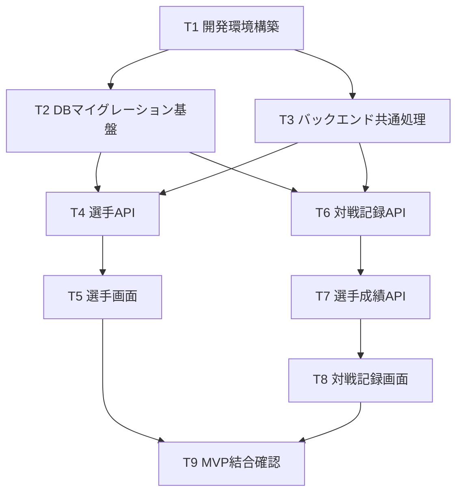

# 08. タスク分解(MVP実装)

- 作成日: 2026-08-09
- 位置づけ: [02_requirements.md](./02_requirements.md)〜[07_architecture.md](./07_architecture.md)の設計を踏まえた、MVP実装のタスク分解。
- 方針: CLAUDE.mdの「1PR=1機能」に沿って、1タスク=概ね1PRを想定した粒度に分ける。バックエンドとフロントエンドは基本的に別PRとし、バックエンドAPIが先行して完成してからフロントエンドで消費する順序とする。

---

## 1. タスク一覧

| ID | タスク | 概要 | 対応docs | 領域 |
|----|--------|------|---------|------|
| T1 | 開発環境構築 | Spring Boot / Next.js プロジェクトの初期セットアップ、Docker Composeによるローカル環境(MySQL含む)構築、簡単な疎通確認 | 07 | 基盤 |
| T2 | DBマイグレーション基盤 + 初期スキーマ作成 | Flywayを導入し、`players` / `records` / `record_player_stats` のマイグレーションファイルを作成・適用 | 05, 07 | 基盤 |
| T3 | バックエンド共通処理実装 | 例外ハンドリング、バリデーションエラーの共通レスポンス形式(`message`/`errors`)、CORS設定等 | 06, 07 | バックエンド |
| T4 | 選手API実装 | `players` の一覧/登録/詳細/更新/削除エンドポイントをController/Service/Repository/DTOで実装 | 06 §3.1 | バックエンド |
| T5 | 選手画面実装 | 選手一覧・登録・詳細・編集画面(打者/投手別の入力項目切り替えを含む) | 04 §4.2〜4.4 | フロントエンド |
| T6 | 対戦記録API実装 | `records` の一覧/作成/詳細/更新/削除エンドポイント(type別フィルタ含む) | 06 §3.2 | バックエンド |
| T7 | 対戦記録の選手成績API実装 | `records/{id}/player-stats` のupsert・削除エンドポイント | 06 §3.3 | バックエンド |
| T8 | 対戦記録画面実装 | 対戦記録一覧・作成(種別選択)・詳細(オーダー編集・成績入力、ランク戦/ルーム戦/大会共通UI) | 04 §4.6〜4.8 | フロントエンド |
| T9 | MVP結合確認 | ローカル環境でフロント〜バックエンド〜DBを通した動作確認。MVP完了基準([03_replace_plan.md](./03_replace_plan.md) 6章)との照合 | 03 §6 | 結合確認 |

## 2. タスク依存関係

T4(選手API)とT6(対戦記録API)は互いに依存しないため、並行して着手できる。

## 3. 各タスクの完了条件(Definition of Done)

### T1: 開発環境構築
- `docker compose up` でMySQLコンテナが起動する
- Spring Bootアプリがローカルで起動し、疎通確認用のエンドポイント(例: ヘルスチェック)が200を返す
- Next.jsアプリが `npm run dev` で起動する

### T2: DBマイグレーション基盤 + 初期スキーマ作成
- Flywayのマイグレーションファイルが [05_database_design.md](./05_database_design.md) 3章の定義通りに`players`/`records`/`record_player_stats`を作成する
- `UNIQUE(record_id, player_id)` 等の制約が反映されている
- マイグレーションがDocker Compose上のMySQLに対して問題なく適用できる

### T3: バックエンド共通処理実装
- バリデーションエラー時に [06_api_design.md](./06_api_design.md) 2章の形式でレスポンスが返る
- 存在しないリソースへのアクセスで404が返る
- フロントエンド(localhost)からのCORSが許可されている

### T4: 選手API実装
- [06_api_design.md](./06_api_design.md) 3.1・4.1の通りにCRUD5エンドポイントが動作する
- 打者/投手それぞれで不要な項目がnullで返る

### T5: 選手画面実装
- 選手一覧(打者/投手タブ)・登録・詳細・編集・削除がUIから一通り操作できる
- T4のAPIと結合して動作する

### T6: 対戦記録API実装
- [06_api_design.md](./06_api_design.md) 3.2・4.2・4.3の通りにCRUDが動作する
- `type`によるフィルタ(`?type=rank_battle`等)が機能する

### T7: 対戦記録の選手成績API実装
- [06_api_design.md](./06_api_design.md) 3.3・4.4の通り、`PUT .../player-stats`が差分upsertとして動作する
- `DELETE .../player-stats/{playerId}`で該当選手の行のみ削除される

### T8: 対戦記録画面実装
- ランク戦: その場でオーダー・成績を入力して保存する一連の流れがUIから操作できる([04_screen_design.md](./04_screen_design.md) 4.7)
- ルーム戦/大会: 現在のオーダー・成績を上書き編集できる(履歴は残さない)
- T6・T7のAPIと結合して動作する

### T9: MVP結合確認
- [03_replace_plan.md](./03_replace_plan.md) 6章の「MVP完了の判断基準」4項目すべてを満たすことを確認する

## 4. 本タスク分解に含まないもの

- P1(分析・効率化機能)、P2(リファクタ・LINE連携)、P3(認証)のタスクは対象外。MVP完了後、各フェーズ着手時に別途タスク分解する
- テストコードの粒度・カバレッジ方針は本ドキュメントでは定義しない(各タスク実装時に検討する)

## 5. 未決定事項

- 各タスクをさらに細かいサブタスク(例: T4を「Entity作成」「バリデーション実装」等)に分けるかどうかは、実装着手時に判断する
- ~~CI(自動テスト・Lint)をどのタイミングで導入するか~~ → T4着手前に導入済み([ADR-0003](./decisions/0003-ci-setup.md)、[09_ci_cd.md](./09_ci_cd.md))
