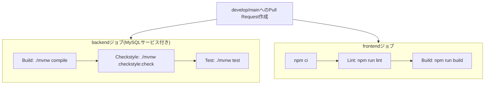

# 09. CI/CD

- 作成日: 2026-08-17
- 位置づけ: [ADR-0003](./decisions/0003-ci-setup.md)で決定したCI方針の、実際の設定内容とその理由の解説。CD(自動デプロイ)は[07_architecture.md](./07_architecture.md) 7章の通りデプロイ先未定のため対象外。

---

## 1. 全体像



設定ファイルは `.github/workflows/ci.yml`。`backend`と`frontend`は独立したジョブとして**並列実行**される(お互いの完了を待たない)。

## 2. 実行タイミング

```yaml
on:
  pull_request:
    branches:
      - develop
      - main
```

**`develop`または`main`宛のPull Requestが作成・更新されたときのみ**実行される。`develop`への直接pushでは実行されない。

これは[ADR-0003](./decisions/0003-ci-setup.md)策定時点の開発フロー(`develop`に直接コミット→まとまったら`develop`→`main`のPRを作成)を前提にした設計だった。その後[ADR-0004](./decisions/0004-branching-strategy.md)で「フィーチャーブランチ→`develop`→`main`」の2段階運用に変更されたため、現在はすべての変更(ドキュメント更新等の小さなものも含む)がフィーチャーブランチ経由の`develop`宛PRとして作られ、その都度CIが働く。6章の通り、`develop`への直接pushはブランチ保護ルールで技術的に禁止しているため、「CIを経由しない変更」自体が原理的に発生しない構成になっている。

## 3. backendジョブの詳細

### 3.1 Build

```yaml
- name: Build
  run: ./mvnw -B compile
```

コンパイルが通るかどけをチェックする。`-B`はMavenのバッチモード(対話的な出力を抑制し、CI向けのログにする)フラグ。

### 3.2 Checkstyle

```yaml
- name: Checkstyle
  run: ./mvnw -B checkstyle:check
```

[ADR-0003](./decisions/0003-ci-setup.md)で決めた通り、Google Java Style(`google_checks.xml`)準拠でコードをチェックする。`backend/pom.xml`の`maven-checkstyle-plugin`設定:

```xml
<plugin>
  <groupId>org.apache.maven.plugins</groupId>
  <artifactId>maven-checkstyle-plugin</artifactId>
  <version>3.6.0</version>
  <configuration>
    <configLocation>google_checks.xml</configLocation>
    <consoleOutput>true</consoleOutput>
    <failOnViolation>true</failOnViolation>
    <violationSeverity>warning</violationSeverity>
  </configuration>
</plugin>
```

Mavenのライフサイクル(`verify`等)には紐付けず、CIから明示的に`checkstyle:check`を呼ぶ方式にしている(`mvn install`のたびに毎回チェックが走ると開発中に煩わしいため)。

**Google Java Style採用にあたって実際に対応した内容**:
- インデントは2スペース固定、タブ文字は禁止(`FileTabCharacter`ルール)。Spring Initializrが生成する雛形はタブ4文字のため、既存ファイルを手動で修正した
- importはグループ分けせず、アルファベット順1本の並びにする(`CustomImportOrder`ルール)
- **全public型・メソッドにJavadocコメントが必須**(`MissingJavadocType`/`MissingJavadocMethod`ルール)。CLAUDE.mdの「不要なコメントは書かない」方針と一見矛盾するが、ルール自体は維持し、対象クラス・メソッドにJavadocを追加する方針にした([ADR-0003](./decisions/0003-ci-setup.md)参照)
- **Javadocの最初の文は半角ピリオド(`.`)で終える必要がある**(`SummaryJavadoc`ルール)。このルールはASCIIのピリオドしか文末として認識せず、日本語の句点(`。`)では検知されない。日本語で書いたJavadocの文末だけ`.`で統一する運用にしている(例: `アプリケーションのエントリーポイント.`)

### 3.3 Test(MySQLサービスコンテナ)

```yaml
services:
  mysql:
    image: mysql:8.0
    env:
      MYSQL_DATABASE: prospi_a_app
      MYSQL_USER: prospi
      MYSQL_PASSWORD: prospi
      MYSQL_ROOT_PASSWORD: root
    ports:
      - 3306:3306
    options: >-
      --health-cmd="mysqladmin ping -h localhost"
      --health-interval=10s
      --health-timeout=5s
      --health-retries=5
```

```yaml
- name: Test
  run: ./mvnw -B test
  env:
    SPRING_PROFILES_ACTIVE: local
```

**なぜ必要か**: `BackendApplicationTests`(Spring Initializrが生成した雛形)には`@SpringBootTest`が付いた`contextLoads()`テストがあり、これは**アプリケーションコンテキスト全体を起動する**(DB接続・Flywayマイグレーション実行を含む)。CI実行環境(GitHub Actionsのランナー)には最初MySQLが存在せず、このテストがDB接続エラーで失敗していた(実際に発生した障害。5章参照)。

`services`はGitHub Actionsの仕組みで、**ジョブの実行中だけ一時的にDockerコンテナを起動**できる。設定値はローカルの`docker/docker-compose.yml`とほぼ同じにしており、`backend/src/main/resources/application-local.yml`の接続設定(`localhost:3306`、ユーザー`prospi`)がそのまま使える。

`options`のヘルスチェックは、MySQLが完全に起動を終えるまで後続のステップ(テスト実行)を待たせるためのもの。これが無いと、MySQLの起動処理中にテストが実行されて接続エラーになることがある。

`SPRING_PROFILES_ACTIVE: local`は、テスト実行時だけ`local`プロファイル(=上記のDB接続設定)を有効にする環境変数。

## 4. frontendジョブの詳細

```yaml
- name: Install dependencies
  run: npm ci
- name: Lint
  run: npm run lint
- name: Build
  run: npm run build
```

`npm ci`は`package-lock.json`を厳密に守ってインストールする(`npm install`と異なりlockファイルを更新しない、CI向けのコマンド)。Lintは`create-next-app`が最初から設定しているESLintをそのまま利用している。

## 5. 導入時に実際に発生した問題と対応(トラブルシューティング記録)

CI導入の過程で実際に踏んだ問題を記録しておく(同種の問題の再発時に参照する)。

| 問題 | 原因 | 対応 |
|------|------|------|
| `pom.xml`が"Duplicated tag: groupId"でパースエラー | `maven-checkstyle-plugin`の設定を、既存の`spring-boot-maven-plugin`の`<plugin>`タグの中に追記してしまい、1つの`<plugin>`要素にgroupId/artifactIdが2組できていた | `</plugin>`で正しく閉じてから新しい`<plugin>`を追加するよう修正 |
| Checkstyleが17件のフォーマット違反で失敗 | 既存ファイルがタブインデント・import順序バラバラ・Javadoc無しの状態だった | フォーマット系(タブ→スペース、import順序)は機械的に修正。Javadoc必須ルールは維持し、該当箇所にJavadocを追加する方針を選択([ADR-0003](./decisions/0003-ci-setup.md)) |
| JavadocがあるのにSummaryJavadocエラー | Javadocの文末が日本語の句点`。`で、Checkstyleの文末判定(半角ピリオド`.`)に一致しなかった | Javadocの文末を半角ピリオドに統一する運用に決定 |
| CI導入PRを誤って`main`に直接マージし、`develop`が取り残された | このプロジェクトは`develop`直接コミット→`develop`→`main`のPRという運用だが、CI動作確認のため一時的にフィーチャーブランチ+PRを使った際、GitHubのデフォルトbase branch(`main`)のまま作成してしまった | `develop`が`main`の祖先(fast-forward可能)だったため、`git merge origin/main`で`develop`を`main`まで進めて解消。以後はPR作成時に必ずbase branchを`develop`に変更することを徹底 |
| backendジョブの`Test`ステップが失敗 | `@SpringBootTest`がアプリ全体を起動しようとするが、CI環境にMySQLが無くDB接続エラー | `services`でMySQL 8.0のコンテナを一時起動し、`SPRING_PROFILES_ACTIVE=local`でテスト時のDB接続先を指定(3.3節) |

## 6. ブランチ保護ルール(`develop`)

CIが実行されること自体と、「CIが失敗したらマージできない」ことは別問題である。GitHubはブランチ保護ルール(Rulesets)を明示的に設定しない限り、CIの結果に関わらずマージ操作(や直接push)を許可してしまう。[ADR-0004](./decisions/0004-branching-strategy.md)の「フィーチャーブランチ→`develop`→`main`」運用と、本ドキュメントのCIチェックを、実際に**強制**するために、`develop`ブランチにRulesetを設定した。

### 6.1 設定内容

GitHub の Settings → Branches → Rulesets で、対象を`develop`ブランチとして以下を有効化した。

| ルール | 効果 |
|---|---|
| Restrict deletions | `develop`ブランチの削除を禁止 |
| Require a pull request before merging | 直接pushを禁止し、PR経由のマージのみ許可 |
| Require status checks to pass | 指定したステータスチェックが成功しないとマージ不可。`backend`・`frontend`(`.github/workflows/ci.yml`のジョブ名)を必須チェックとして登録 |
| Block force pushes | 履歴の強制書き換えを禁止 |

### 6.2 設定時にハマった落とし穴(トラブルシューティング記録)

Ruleset作成直後、`develop`への直接pushが**成功してしまう**という現象が発生した。原因は1つではなく、2段階で判明した。

| 症状 | 原因 | 対応 |
|------|------|------|
| Ruleset編集画面に "This ruleset does not target any resources and will not be applied." という警告が出ていた | **Target branches**(このRulesetをどのブランチに適用するか)に`develop`を登録し忘れていた。ルール自体(Require a pull requestなど)を有効にしても、適用対象が空だと何も強制されない | Target branches → Add target → Add by pattern で`develop`を追加 |
| Target branchesを設定した後も直接pushが通ってしまった | **Enforcement status**が`Active`になっていなかった(`Evaluate`等のままだと、違反をログに記録するだけで実際には拒否しない) | Enforcement statusを`Active`に変更 |

上記2点を修正した後、`develop`への直接push(空コミットで検証)が以下のエラーで正しく拒否されることを確認した。

```
remote: error: GH013: Repository rule violations found for refs/heads/develop.
remote: - Changes must be made through a pull request.
remote: - 2 of 2 required status checks are expected.
```

**教訓**: Rulesetは「ルールにチェックを入れただけでは機能しない」。**Target branches(適用対象)**と**Enforcement status(有効化状態)**の両方が正しく設定されているかを、実際に保護対象への直接push(空コミット等、実害のない変更)を試して動作確認するまで安心しないこと。

## 7. 未決定・今後の課題

- `frontend`ジョブにテストが無い(現状ESLintとビルド確認のみ)。フロントエンドのテストコードを書き始めたら、テスト実行ステップを追加する
- モノレポ全体でbackend/frontend変更の有無に関わらず両ジョブが毎回実行される。将来的に`paths`フィルタで「変更があった方のジョブだけ実行する」最適化を検討してもよい(現時点では規模が小さいため未対応)
- CD(自動デプロイ)は[07_architecture.md](./07_architecture.md)の通りクラウドデプロイ先が決まってから設計する
